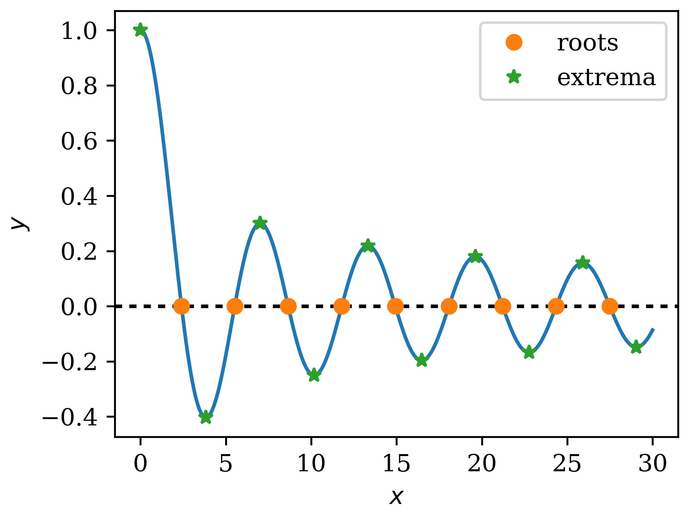

# Summary

Chebyshev-basis expansions, and more broadly, orthogonal polynomial expansions, are commonly used as numerical approximations of continuous functions on closed domains [@Boyd-SIAM-2013,@Mason-BOOK-2003,@Battles-SJSC-2004].   One of the most successful projects that makes use of the Chebyshev expansions is the ``chebfun`` library [@chebfun] for MATLAB.  Other similar libraries are ``pychebfun``^[https://github.com/pychebfun], ``chebpy``^[https://github.com/chebpy/chebpy], and ``Approxfun``^[https://github.com/JuliaApproximation/ApproxFun.jl]. Our library ``ChebTools`` fills a similar niche as that of ``chebfun`` -- working with Chebyshev expansions.

The primary motivation for the development of ``ChebTools`` is the need for a highly optimized and fast C++11 library for working with Chebyshev expansions in order to do one-dimensional rootfinding from nonlinear functions of multiple variables that arise out of thermodynamic modeling (equations of state of multiple state variables).  A manuscript on this topic is forthcoming that builds off the tools developed in ``ChebTools``.

Internally, the header-only library ``Eigen``^[http://eigen.tuxfamily.org] is used to carry out all the matrix operations, allowing for behind-the-scenes vectorization without any user intervention.  Thus the library is also very computationally efficient.

A short list of the capabilities of ``ChebTools`` is as follows:

* Construct a Chebyshev expansion approximation of any one-dimensional function in an arbitrary closed domain.
* Apply numerical operators on expansions : addition, subtraction, multiplication, arbitrary mathematical functions.
* Find all roots of the function.
* Calculate the derivative of the expansion.

While C++11 allows for the development of very computationally-efficient code, users often prefer a higher-level interface.  As such, a comprehensive one-to-one Python wrapper of ``ChebTools`` was developed through the use of the pybind11^[https://github.com/pybind/pybind11] library(@pybind11).  This library offers the capability to natively integrate C++11 and Python - it is, for instance, trivial to pass Python functions to C++ functions accepting C++11 ``std::function`` (for use as a callback, or here, as the function sampled to generate the expansion).

We provide a ``jupyter`` notebook [@Perez2007] mirroring much of the example code from Battles and Trefethen [-@Battles-SJSC-2004] and ``pychebfun``.  Furthermore, a binder^[https://mybinder.org/] environment has been configured such that ChebTools can be explored in an online jupyter notebook without installing anything on the user's computer.

In this Python code block, we demonstrate finding the roots and extrema of the 0-th Bessel function in the closed domain [0, 30]:

``` python
import scipy.special
import ChebTools
# Only keep the roots that are in [-1,1] in scaled coordinates
only_in_domain = True
# The 0-th Bessel function (for code concision)
def J0(x): return scipy.special.jn(0,x)
# Make a 200-th order expansion of the 0-th Bessel function in [0,30]
f = ChebTools.generate_Chebyshev_expansion(200, J0, 0, 30)
# Roots of the function
rts = f.real_roots(only_in_domain)
# Extrema of the function (roots of the derivative, where dy/dx =0)
extrema = f.deriv(1).real_roots(only_in_domain)
```

A graphical representation of the roots and extrema of the 0-th Bessel function in the closed domain [0, 30] is shown in the ``jupyter`` notebook in the repository and is also displayed here:



# Disclaimer

Contribution of the National Institute of Standards and Technology, not subject to copyright in the U.S.  Commercial equipment, instruments, or materials are identified only in order to adequately specify certain procedures. In no case does such identification imply recommendation or endorsement by the National Institute of Standards and Technology, nor does it imply that the products identified are necessarily the best available for the purpose.

# References
